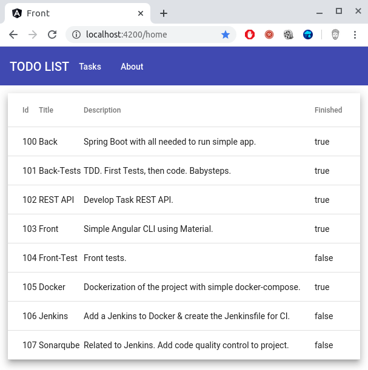
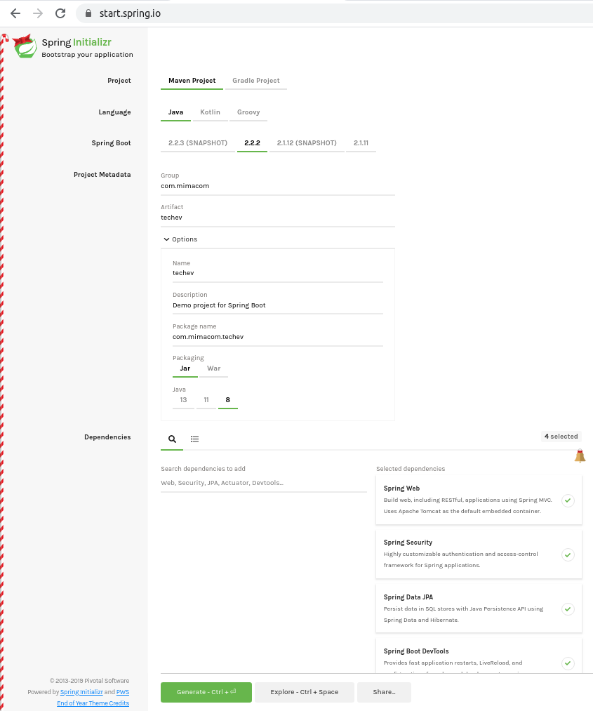

# Mimacom.com Technical Evaluation
# Author:
**Tomás GARCÍA-POZUELO**

January 2nd, 2020
Mimacom Technical Evaluation

# Getting Started
### Introduction
This is the exersice proposed by mimacom for technical evaluation of Tomás GARCÍA-POZUELO.
Even if the problem was to create a REST API I've done also a simple front webpage with Angular & Material to show directly a simple use of the API without using curl/postman/insomnia.

### How to run
First of all, its needed to clone the repository.
```git clone https://github.com/oleuzop/com.mimacom.techev.git```

There are two ways to execute the application.
* With console (or/plus IDE of your choice)
* or using Docker.

I recommend using Docker so it won't be necessary to install Java 8 JDK / Maven / Node.js / Angular.

#### Using Console
**Prerequisites:**
- Ubuntu or OS X (haven't tested under Windows)
- Java JDK 1.8+
- Maven 3+
- Node.js

**BACK**
- 0: Open a new console. Go to directory ```com.mimacom.techev/back```
- 1: ```mvn clean install && mvn spring-boot:run```
- 2: curl to http://localhost:8080 to test: ```curl http://localhost:8080/task``` (or use Postman)

**FRONT**
- 0: Open a new console. Go to directory ```com.mimacom.techev/front```
- 1: ```npm install && ng serve```
- 2: Go to http://localhost:4200/

Something as following should be shown:



#### Using Docker

There is a bash script to execute the application out of the box. Only needed to execute:

```./startWithDocker.sh```

This will create two containers, using docker-compose, to have the back and the front. No Java, Maven, Node.JS,... 
needed to make the application work.

The only handicap is that each time it's executed it will download all dependencies, build and execute. So no suitable 
at all for a dev environment.

The biggest different in using it is that, as ```npm build``` is done, instead of ```ng serve``` then the port 
by default is 80, so it's possible to access the app at: http://localhost/

## Original exercise text
La aplicación debe permitir tanto la:
* creación de tareas nuevas
* como el borrado
* y la edición de tareas existentes.
* Asímismo, una tarea ya realizada debe poder marcarse como finalizada.

El candidato tendrá que desarrollar este ejercicio utilizando Java y Spring Framework,
dejando a su libre elección tanto las versiones a utilizar como el resto de tecnologías que
puedan necesitarse para completar la funcionalidad, como por ejemplo, la tecnología con la
que se va a construir el proyecto (Maven, Gradle, Ant, etc).

Como entregable final, se facilitará el acceso al código fuente original, en el formato elegido por
el candidato, así como los pasos a seguir para poner la aplicación en marcha.

## REST API design
* **[POST]** Create new task. Body => New task to be created.
* **[DELETE]** Delete new task. Path => Id of the task to be deleted.
* **[PUT]** Edit existing task 
* **[POST]** Finish existing task

Extra Endpoints
* **[GET]** List all tasks 

## How it has been done



## Used tools / frameworks

### Back
* IntelliJ IDEA 2019.3 Community Edition (https://www.jetbrains.com/idea/)
* Spring Boot / Spring Data / Spring Security / Spring Web (https://spring.io/)
* MapStruts (https://mapstruct.org/)
* H2 Database (https://www.h2database.com/html/main.html)
* Mockito (https://site.mockito.org/)
* JUnit 5 (https://junit.org/)

### Front
* Visual Studio Code 1.41.1
* Angular CLI
* Material
* GitHub

### DevOps
* Docker version 19.03.5
* GitHub (repo)

### TODO (future work I'd would liked to have done)
* Swagger
* Sonarqube
* Jenkins (.Jenkinsfile)

* Check Unit Tests
* Check JavaDoc
* Spring Security
* Rework ExceptionHandler
* Docker

### Reference Documentation
For further reference, please consider the following sections:

* [Official Apache Maven documentation](https://maven.apache.org/guides/index.html)
* [Spring Boot Maven Plugin Reference Guide](https://docs.spring.io/spring-boot/docs/2.2.2.RELEASE/maven-plugin/)
* [Spring Web](https://docs.spring.io/spring-boot/docs/2.2.2.RELEASE/reference/htmlsingle/#boot-features-developing-web-applications)
* [Spring Security](https://docs.spring.io/spring-boot/docs/2.2.2.RELEASE/reference/htmlsingle/#boot-features-security)
* [Spring Data JPA](https://docs.spring.io/spring-boot/docs/2.2.2.RELEASE/reference/htmlsingle/#boot-features-jpa-and-spring-data)
* [Spring Boot DevTools](https://docs.spring.io/spring-boot/docs/2.2.2.RELEASE/reference/htmlsingle/#using-boot-devtools)

### Guides
The following guides illustrate how to use some features concretely:

* [Building a RESTful Web Service](https://spring.io/guides/gs/rest-service/)
* [Serving Web Content with Spring MVC](https://spring.io/guides/gs/serving-web-content/)
* [Building REST services with Spring](https://spring.io/guides/tutorials/bookmarks/)
* [Securing a Web Application](https://spring.io/guides/gs/securing-web/)
* [Spring Boot and OAuth2](https://spring.io/guides/tutorials/spring-boot-oauth2/)
* [Authenticating a User with LDAP](https://spring.io/guides/gs/authenticating-ldap/)
* [Accessing Data with JPA](https://spring.io/guides/gs/accessing-data-jpa/)

